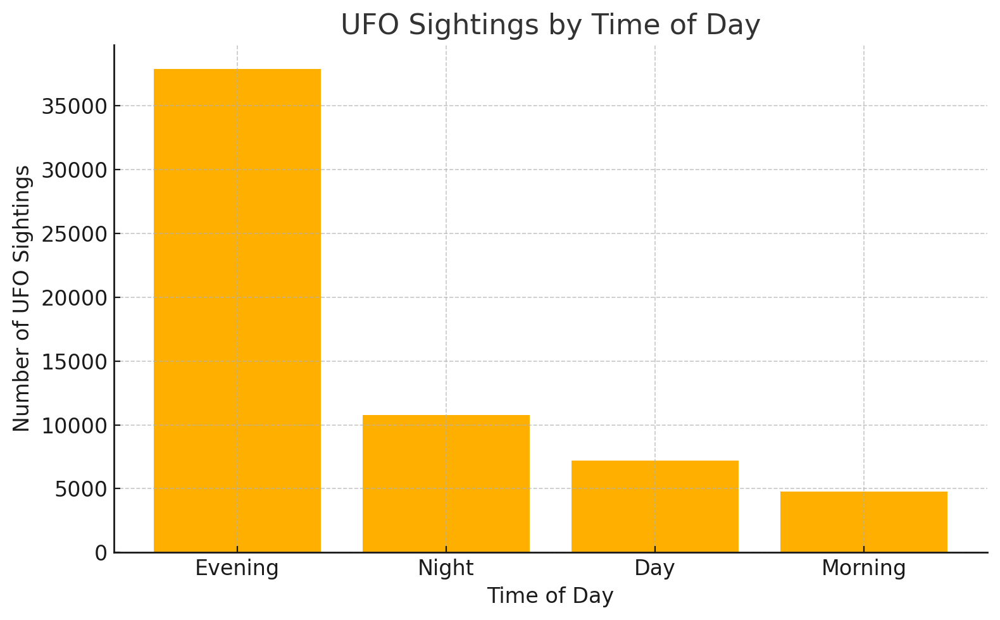
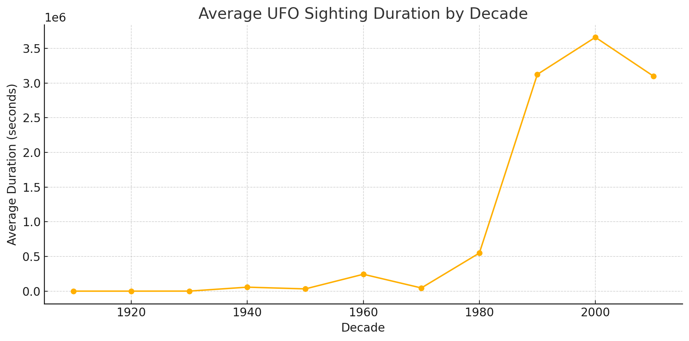
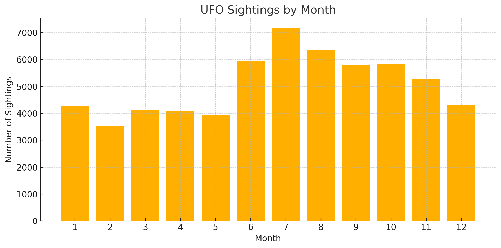

# Introduction
🛸 Explore patterns in UFO sightings across the United States through real-world data analysis. This project dives into when, where, and how people have reported unidentified flying objects — examining trends by location, time, shape, and duration. Through a series of SQL queries, the project uncovers insights into one of the most mysterious and persistent phenomena in modern folklore.

🔍 SQL queries? Check them out here: [sql_files folder](/sql_files/)


# Background
Inspired by decades of fascination with the unknown, this project explores UFO sightings across the United States using real-world data. It began with a simple curiosity: when and where do people report UFOs the most? Over time, it evolved into a structured SQL-based investigation uncovering patterns by location, shape, time, and duration.

The data was compiled from a publicly available UFO sightings dataset and transformed into a relational structure for deeper querying and insight generation.

### The questions I wanted to answer through my SQL queries were:

1. Which U.S. states report the most UFO sightings?
2. What times of day see the most UFO activity?
3. What are the most commonly reported UFO shapes, and how have they changed over time?
4. How long do sightings typically last, and which shapes last the longest?
5. Are there any seasonal patterns in UFO reports?


# Tools I Used
For my deep dive into UFO sighting data, I relied on several essential tools:

- **SQL**: The core of my analysis — used to explore, aggregate, and uncover patterns in UFO reports.
- **PostgreSQL**: My chosen relational database system, perfect for managing structured UFO sightings and location data.
- **Visual Studio Code**: My primary development environment for writing, testing, and organizing SQL queries.
- **Git & GitHub**: Used for version control and sharing the full set of SQL scripts and documentation.

# The Analysis
Each SQL query in this project was designed to explore specific patterns within UFO sighting data — from geographic concentration and seasonal trends to sighting durations and shape evolutions. Below is a breakdown of how I approached the key analytical questions behind the dataset.

### 1. Identifying States with the Most UFO Sightings

To determine which parts of the U.S. report the most UFO activity, I aggregated the total number of sightings by state using the `locations` table. The query groups all entries by `state` and ranks them by total sighting count in descending order, returning the top 10.

```sql
SELECT 
    state,
    COUNT(*) AS sightings_count
FROM 
    locations
GROUP BY 
    state
ORDER BY
    sightings_count DESC
LIMIT 10; 
```

#### 🔍 Insights:

- **California** stands out significantly with over 8,000 reports — more than double the next highest state.
- Other high-ranking states include **Florida**, **Washington**, and **Texas**.
- The distribution may reflect a combination of population size, visibility conditions, and regional awareness or interest in UFO phenomena.


### 2. Analyzing UFO Sightings by Time of Day

To understand when UFO sightings are most likely to occur, I categorized each report into one of four time-of-day windows based on the `sighted_hour` value: Night (0–5), Morning (5–11), Day (11–17), and Evening (17–24). I then counted the number of sightings within each category to identify peak periods of activity.



#### 🔍 Insights:

- **Evening** is by far the most common time for reported sightings, with over 37,000 incidents.
- **Nighttime** reports come in second, followed by **daytime**, with **morning** showing the lowest activity.
- The trend suggests that sightings tend to occur after sunset, likely due to greater visibility of unusual lights in the night sky or increased outdoor activity in the evening hours.

### 3. Tracking the Most Common UFO Shapes by Decade

To examine how reported UFO shapes have changed over time, I grouped sightings by decade and shape, then selected the most commonly reported shape for each decade. The query uses a window function to rank shapes by count within each decade and extracts the top one.

```sql
WITH cte_table_1 AS(
    SELECT
        FLOOR(sighted_year/10) * 10 AS decade,
        shape,
        COUNT(*) AS total
    FROM 
        sightings
    GROUP BY
        decade, shape
), 
cte_table_2 AS(
    SELECT *,
        ROW_NUMBER() OVER(
            PARTITION BY decade
            ORDER BY total DESC
        ) AS rn
    FROM 
        cte_table_1
)
SELECT
    decade,
    shape,
    total
FROM 
    cte_table_2
WHERE
    rn = 1
ORDER BY
    decade ASC
```

#### 🔍 Insights:

- Between the **1940s and 1970s**, the most commonly reported shape was consistently **"disk"**, aligning with the classic "flying saucer" stereotype.
- From the **1990s onward**, **"light"** sightings became dominant, marking a noticeable shift in the type of phenomena people report.
- This trend may reflect changing perceptions of UFOs in media, evolving technologies (e.g., drones, satellites), or broader public interpretation of aerial anomalies.

### 4. Longest UFO Sightings per Shape by Decade

To uncover the most prolonged UFO sightings, I identified the single longest sighting for each shape within every decade. This was done by grouping the data by both shape and decade (derived from `sighted_year`), then selecting the maximum `duration_seconds` using a window function.



#### 🔍 Insights:

- Certain shapes like **"changing"** and **"chevron"** consistently appear as top-duration sightings across multiple decades, from the **1940s** to the **2010s**.
- This persistence suggests that some types of UFOs, particularly those described as morphing or structured, tend to be observed for longer periods — possibly indicating more complex or engaging phenomena.
- Average UFO sighting durations drastically increased starting in the 1990s, peaking in the 2000s


### 5. Examining UFO Sightings by Month of the Year

To investigate potential seasonal patterns in UFO activity, I grouped sightings by the month they were reported (`sighted_month`). This aggregation reveals which times of year tend to have the highest and lowest volumes of sightings.

```sql
SELECT
    sighted_month,
    COUNT(*) AS count
FROM 
    sightings
GROUP BY
    sighted_month
ORDER BY
    count DESC 
```

#### 🔍 Insights:

- **July** is the peak month for UFO sightings, followed closely by **August** and **June**, suggesting a strong **summer spike**.
- **Winter months** — particularly **February** and **January** — have the fewest reports.
- This trend may be influenced by longer daylight hours, better weather, and more outdoor activity in the summer, increasing the chances of observing and reporting unusual objects in the sky.



# What I Learned

Working through this UFO sightings project helped me sharpen key SQL skills and better understand how to extract insights from real-world datasets. Here are a few major takeaways:

- **🧩 Complex Query Crafting:** Learned to use CTEs (`WITH` clauses), window functions, and subqueries to answer layered analytical questions.
- **📊 Data Aggregation:** Got hands-on with `GROUP BY`, `COUNT()`, `AVG()`, and `MAX()` to identify patterns and trends across different dimensions.
- **🧠 Logical Thinking:** Practiced breaking down broad questions into precise steps and building efficient queries to answer them.
- **🗂️ Data Joining:** Improved my use of `JOIN` clauses to bring together multiple tables and work with relational data structures.
- **📅 Temporal Analysis:** Gained experience in analyzing time-based patterns using `YEAR`, `MONTH`, and `HOUR` fields.

This project was not just about querying data — it was about learning to **think like a data analyst**, and turn raw information into meaningful insights.


# Conclusion
This project was a deep dive into UFO sightings across the United States — not just to explore strange phenomena, but to develop real-world SQL skills through structured analysis. From identifying geographic hotspots to tracking how sighting patterns evolve over time, each query contributed to a broader understanding of how data can tell a story — even when that story involves flying saucers.

Along the way, I strengthened my ability to write complex SQL queries, interpret patterns, and communicate findings clearly. Whether you're a believer or a skeptic, one thing is certain: data analysis can shed light on even the most mysterious subjects.
